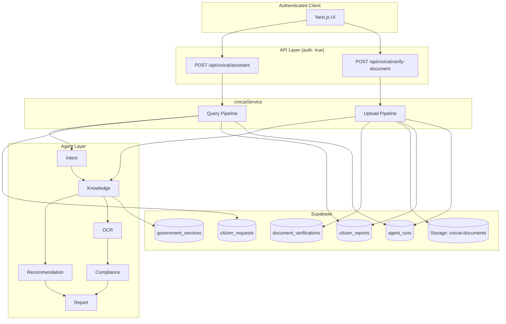
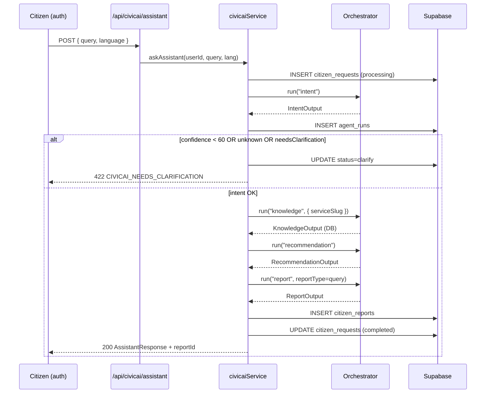
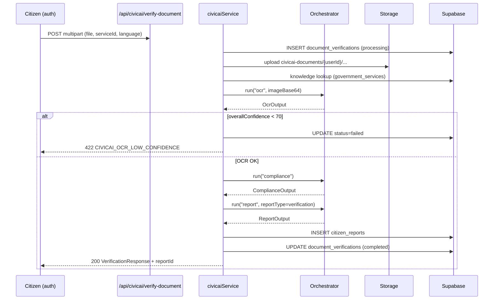
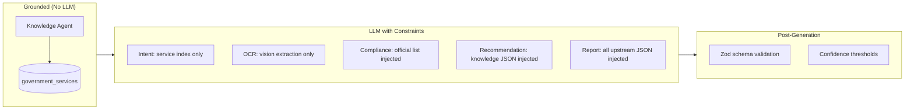

# CivicAI Agent Architecture

**Project:** CivicAI — Pakistan Citizen Assistant  
**Version:** 1.0.0  
**Scope:** Multi-agent decision assistant for government service navigation and document verification  
**Implementation:** `agents/*.agent.ts`, `agents/civicai-schemas.ts`, `services/civicai.service.ts`

---

## 1. Executive Summary

CivicAI is **not a chatbot**. It is a **structured multi-agent decision system** that guides Pakistani citizens through official government procedures using verified knowledge, structured outputs, and auditable agent runs.

| Principle                  | Implementation                                                         |
| -------------------------- | ---------------------------------------------------------------------- |
| Ground truth for fees/docs | `KnowledgeAgent` reads `government_services` (DB-first, mock fallback) |
| No official accusations    | Compliance agent uses polite advisory language                         |
| Structured I/O             | Zod schemas validate every agent input/output                          |
| Auditability               | Every agent run logged to `agent_runs`                                 |
| Auth everywhere            | All CivicAI API routes require authenticated Supabase session          |

---

## 2. System Context



---

## 3. Agent Registry

All CivicAI agents extend `BaseAgent` (`agents/base-agent.ts`) and are registered in `agents/registry.ts`.

| Agent          | Name             | LLM?                | Template ID            |
| -------------- | ---------------- | ------------------- | ---------------------- |
| Intent         | `intent`         | Yes (Gemini)        | `civic.intent`         |
| Knowledge      | `knowledge`      | **No** (DB lookup)  | — (via DB)             |
| OCR            | `ocr`            | Yes (Gemini Vision) | `civic.ocr`            |
| Compliance     | `compliance`     | Yes (Gemini)        | `civic.compliance`     |
| Recommendation | `recommendation` | Yes (Gemini)        | `civic.recommendation` |
| Report         | `report`         | Yes (Gemini)        | `civic.report`         |

---

## 4. Agent Specifications

### 4.1 Intent Agent

**File:** `agents/intent.agent.ts`  
**Purpose:** Detect citizen intent, language, entities, and map query to a known government service slug.

#### Inputs

```json
{
  "query": "string (min 1)",
  "language": "en | ur (default: en)"
}
```

#### Outputs

| Field                   | Type       | Description                          |
| ----------------------- | ---------- | ------------------------------------ |
| `detectedLanguage`      | `en \| ur` | Detected query language              |
| `translatedQuery`       | string     | English translation if Urdu          |
| `intent`                | string     | Short label (e.g. `license_renewal`) |
| `serviceSlug`           | string     | Matched slug or `unknown`            |
| `serviceName`           | string     | Human-readable service name          |
| `entities`              | string[]   | Locations, documents, dates          |
| `confidence`            | 0–100      | Match confidence                     |
| `needsClarification`    | boolean    | Whether to ask follow-up             |
| `clarificationQuestion` | string     | Follow-up question if needed         |

#### Guardrails

- Service index injected from `governmentKnowledgeService.getServiceIndex()` — **must not invent services**
- Extra system instruction: _"Never invent services not in the index"_
- Temperature: `0.2` (low creativity)

#### Confidence Threshold

```typescript
INTENT_CONFIDENCE_THRESHOLD = 60; // agents/civicai-schemas.ts
```

Pipeline stops with `CIVICAI_NEEDS_CLARIFICATION` when:

- `confidence < 60`, OR
- `needsClarification === true`, OR
- `serviceSlug === "unknown"`

#### Failure Handling

| Failure                  | HTTP Code | DB Status | User Message            |
| ------------------------ | --------- | --------- | ----------------------- |
| Input validation         | 422       | `failed`  | Schema error details    |
| LLM/parse error          | 422       | `failed`  | Intent detection failed |
| Low confidence / clarify | 422       | `clarify` | `clarificationQuestion` |

#### Retry

No automatic LLM retry in current implementation. Client may resubmit clarified query. Input validation failures are not retriable without fixing payload.

---

### 4.2 Knowledge Agent

**File:** `agents/knowledge.agent.ts`  
**Purpose:** Retrieve structured government knowledge from verified database — **zero LLM hallucination path**.

#### Inputs

```json
{
  "serviceSlug": "string (min 1)"
}
```

#### Outputs

| Field            | Type           | Description                  |
| ---------------- | -------------- | ---------------------------- |
| `serviceSlug`    | string         | Canonical slug               |
| `serviceName`    | string         | Display name                 |
| `category`       | string         | e.g. `transport`, `identity` |
| `department`     | string         | Issuing authority            |
| `officeName`     | string \| null | Office name                  |
| `officeAddress`  | string \| null | Office address               |
| `fee`            | string         | Official fee text            |
| `processingTime` | string         | Expected duration            |
| `documents`      | string[]       | Required document list       |
| `warnings`       | string[]       | Scam/fee warnings            |
| `instructions`   | string[]       | Step-by-step procedure       |
| `description`    | string         | Service summary              |

#### Guardrails

- **No LLM call** — pure DB read via `governmentKnowledgeService.getBySlug()`
- Supabase `government_services` table is source of truth
- Fallback to in-memory mock (`lib/civicai/data/services.ts`) if DB unavailable
- Throws `SERVICE_NOT_FOUND` (404) if slug missing in both sources

#### Confidence Threshold

N/A — deterministic retrieval.

#### Failure Handling

| Failure             | Action                                                  |
| ------------------- | ------------------------------------------------------- |
| Service not found   | 404, pipeline abort, `citizen_requests.status = failed` |
| DB connection error | Silent fallback to mock data                            |

#### Retry

Safe to retry — idempotent read. No side effects.

---

### 4.3 OCR Agent

**File:** `agents/ocr.agent.ts`  
**Purpose:** Extract document names from uploaded officer note images (handwritten or printed).

#### Inputs

```json
{
  "imageBase64": "string (min 1)",
  "mimeType": "string (min 1)",
  "serviceName": "string (default: Government Service)",
  "language": "en | ur (default: en)"
}
```

#### Outputs

| Field               | Type   | Description                            |
| ------------------- | ------ | -------------------------------------- |
| `rawText`           | string | Full extracted text                    |
| `documents`         | array  | `{ name, normalizedName, confidence }` |
| `overallConfidence` | 0–100  | Image/read quality score               |

#### Guardrails

- Temperature: `0.1` (minimal hallucination)
- Normalizes document names (e.g. `"ID card" → "CNIC"`)
- Vision model via `generateVisionStructuredResponse`
- Allowed upload types: JPEG, PNG, WebP, GIF; max 8 MB

#### Confidence Threshold

```typescript
OCR_CONFIDENCE_THRESHOLD = 70; // agents/civicai-schemas.ts
```

Below threshold → `CIVICAI_OCR_LOW_CONFIDENCE`, verification status `failed`.

#### Failure Handling

| Failure               | HTTP Code | DB Status                       |
| --------------------- | --------- | ------------------------------- |
| OCR/parse failure     | 422       | `failed`                        |
| Low confidence (< 70) | 422       | `failed` (OCR result persisted) |

#### Retry

Citizen should re-upload clearer image. No automatic model retry.

---

### 4.4 Compliance Agent

**File:** `agents/compliance.agent.ts`  
**Purpose:** Compare OCR-extracted document list against official checklist; flag suspicious requests.

#### Inputs

```json
{
  "serviceName": "string",
  "officialDocuments": ["string"],
  "extractedDocuments": [
    { "name": "string", "normalizedName": "string?", "confidence": "number?" }
  ],
  "language": "en | ur"
}
```

#### Outputs

| Field                | Type     | Description                 |
| -------------------- | -------- | --------------------------- |
| `serviceName`        | string   | Service context             |
| `complianceScore`    | 0–100    | Overall alignment score     |
| `items`              | array    | `{ name, status, note }`    |
| `missingDocuments`   | string[] | Official docs not requested |
| `suspiciousRequests` | string[] | Docs not on official list   |
| `advisory`           | string   | Polite citizen guidance     |

**Document status enum:** `required | optional | unknown | missing | verified`

#### Guardrails

- Extra system: _"Never accuse government officials"_
- Official documents sourced from Knowledge agent (DB), not LLM
- Temperature: `0.2`
- Polite, careful wording in advisory

#### Confidence Threshold

Uses `complianceScore` (0–100) as persisted verification confidence. No hard pipeline cutoff — low scores still return advisory.

#### Failure Handling

| Failure              | Action                                        |
| -------------------- | --------------------------------------------- |
| LLM/validation error | 422, `document_verifications.status = failed` |

#### Retry

Single attempt per upload. User may re-upload to re-run full upload pipeline.

---

### 4.5 Recommendation Agent

**File:** `agents/recommendation.agent.ts`  
**Purpose:** Generate citizen checklist, tips, timeline, FAQs, and next steps grounded in knowledge data.

#### Inputs

```json
{
  "serviceKnowledge": "string (JSON-serialized KnowledgeOutput)",
  "intentSummary": "string (JSON-serialized IntentOutput)",
  "language": "en | ur"
}
```

#### Outputs

| Field             | Type     | Description                        |
| ----------------- | -------- | ---------------------------------- |
| `checklist`       | array    | `{ name, status }`                 |
| `preparationTips` | string[] | Practical prep advice              |
| `timeline`        | array    | `{ step, description, duration? }` |
| `faqs`            | array    | `{ question, answer }`             |
| `alternatives`    | string[] | Alternative paths                  |
| `nextSteps`       | string[] | Immediate actions                  |
| `warnings`        | string[] | Scam prevention                    |

#### Guardrails

- Knowledge JSON injected verbatim from DB — model must align with provided facts
- Temperature: `0.3`
- Warnings merged with DB warnings in final response

#### Confidence Threshold

Inherits intent confidence for overall response scoring.

#### Failure Handling

422 → `citizen_requests.status = failed`, code `CIVICAI_RECOMMENDATION_FAILED`.

---

### 4.6 Report Agent

**File:** `agents/report.agent.ts`  
**Purpose:** Assemble final citizen summary, printable sections, PDF content, and QR metadata.

#### Inputs

```json
{
  "reportType": "query | verification",
  "serviceName": "string",
  "intentData": "string (JSON, default: {})",
  "knowledgeData": "string (JSON)",
  "recommendationData": "string (JSON, default: {})",
  "complianceData": "string (JSON, default: {})",
  "language": "en | ur"
}
```

#### Outputs

| Field               | Type   | Description                                                    |
| ------------------- | ------ | -------------------------------------------------------------- |
| `citizenSummary`    | string | 2–3 paragraph summary                                          |
| `printableSections` | array  | `{ title, content }`                                           |
| `pdfTitle`          | string | PDF header                                                     |
| `pdfSections`       | array  | `{ heading, body }`                                            |
| `qrData`            | string | JSON string for QR encoding                                    |
| `metadata`          | object | `{ serviceName, department, fee, processingTime, confidence }` |

#### Guardrails

- All upstream pipeline data passed as serialized JSON — report synthesizes, does not invent fees
- Temperature: `0.3`
- `reportType` determines which upstream fields are populated

#### Failure Handling

422 → parent record (`citizen_requests` or `document_verifications`) set to `failed`.

---

## 5. Agent Communication Flow

### 5.1 Query Pipeline (Assistant)



### 5.2 Upload Pipeline (Document Verification)



### 5.3 Inter-Agent Data Contract

| From               | To             | Payload                         |
| ------------------ | -------------- | ------------------------------- |
| Intent             | Knowledge      | `{ serviceSlug }`               |
| Intent + Knowledge | Recommendation | Serialized JSON strings         |
| All upstream       | Report         | Serialized JSON by `reportType` |
| Knowledge          | Compliance     | `officialDocuments[]`           |
| OCR                | Compliance     | `extractedDocuments[]`          |

Agents do **not** call each other directly. `civicaiService` orchestrates sequential `orchestrator.run()` calls.

---

## 6. Memory Strategy

### 6.1 In-Process Run Memory

`agents/memory.ts` — `AgentMemoryStore`:

| Property        | Value                                                  |
| --------------- | ------------------------------------------------------ |
| Scope           | Per `runId` (UUID)                                     |
| Max entries/run | 50                                                     |
| Storage         | In-memory `Map` (server process)                       |
| Records         | `{ runId, agentName, timestamp, success, durationMs }` |

Used for pipeline observability within a single request lifecycle. **Not persisted** across requests.

### 6.2 Persistent Audit Memory

`civicaiPersistence.logAgentRun()` writes to `agent_runs`:

| Column        | Purpose                                          |
| ------------- | ------------------------------------------------ |
| `parent_type` | `request` \| `verification`                      |
| `parent_id`   | FK to citizen_requests or document_verifications |
| `agent_name`  | Agent identifier                                 |
| `output`      | Structured agent result (JSONB)                  |
| `success`     | Boolean                                          |
| `duration_ms` | Latency                                          |

Logging is **non-blocking** — failures in audit write do not fail the pipeline.

### 6.3 Citizen History

- `citizen_requests.pipeline_result` — full query pipeline JSON on completion
- `citizen_reports.report_json` — immutable report snapshot
- `document_verifications.ocr_result` / `compliance_result` — verification artifacts

---

## 7. Hallucination Prevention



| Layer                  | Mechanism                                                |
| ---------------------- | -------------------------------------------------------- |
| **Source of truth**    | Fees, documents, departments from `government_services`  |
| **Intent grounding**   | Service slug must exist in index                         |
| **Structured output**  | Zod schemas reject malformed/hallucinated fields         |
| **Low temperature**    | 0.1–0.3 across agents                                    |
| **Compliance ethics**  | Never accuse officials; flag suspicious docs as advisory |
| **Clarification gate** | Low intent confidence blocks downstream LLM calls        |

---

## 8. Fallback Strategy

| Scenario                 | Fallback                                                               |
| ------------------------ | ---------------------------------------------------------------------- |
| Supabase unavailable     | `governmentKnowledgeService` uses mock data from `GOVERNMENT_SERVICES` |
| Intent unclear           | Return clarification question; status `clarify` — no downstream agents |
| OCR low quality          | Fail fast; prompt re-upload — no compliance on bad OCR                 |
| Agent LLM failure        | Pipeline abort; parent record `failed`; partial `agent_runs` preserved |
| Audit log failure        | Swallowed silently; pipeline continues                                 |
| `GEMINI_API_KEY` missing | 503 `AI_UNAVAILABLE` before any agent runs                             |

**No silent degradation** on query pipeline: if Knowledge fails, user gets explicit error — not a guessed answer.

---

## 9. Base Agent Execution Model

All agents inherit shared behavior from `BaseAgent.execute()`:

1. Validate input against Zod `inputSchema`
2. Execute `run()` with `AgentContext` (`runId`, `projectName`, `environment`)
3. Record in-memory memory entry
4. Log structured event (`agent.run` JSON in production)
5. Return `{ success, data?, error?, metadata }`

Pipeline orchestrator (`agents/orchestrator.ts`) stops on first failed step.

---

## 10. Authentication & Authorization

All CivicAI endpoints require `auth: true` in `createApiHandler`:

| Route                          | Method | Auth     |
| ------------------------------ | ------ | -------- |
| `/api/civicai/assistant`       | POST   | Required |
| `/api/civicai/verify-document` | POST   | Required |
| `/api/civicai/history`         | GET    | Required |
| `/api/civicai/reports/[id]`    | GET    | Required |
| `/api/civicai/stats`           | GET    | Required |
| `/api/civicai/services`        | GET    | Required |

**RLS policies:** Users can only read/write their own rows in `citizen_requests`, `document_verifications`, `citizen_reports`, and `agent_runs`. `government_services` is read-only for all authenticated users.

---

## 11. Supabase Data Model (CivicAI)

| Table                    | Pipeline | Key Fields                                                                            |
| ------------------------ | -------- | ------------------------------------------------------------------------------------- |
| `government_services`    | Both     | `slug`, `documents`, `fee`, `processing_time`, `warnings`                             |
| `citizen_requests`       | Query    | `query`, `detected_intent`, `service_slug`, `confidence`, `status`, `pipeline_result` |
| `document_verifications` | Upload   | `storage_path`, `ocr_result`, `compliance_result`, `confidence`, `status`             |
| `citizen_reports`        | Both     | `summary`, `report_json`, `qr_data`, FK to request/verification                       |
| `agent_runs`             | Both     | Audit trail per agent invocation                                                      |

**Status values:**

- `citizen_requests`: `pending | processing | completed | failed | clarify`
- `document_verifications`: `pending | processing | completed | failed`

---

## 12. Confidence Threshold Summary

| Agent / Gate | Threshold     | Action if Below                          |
| ------------ | ------------- | ---------------------------------------- |
| Intent       | **≥ 60**      | Clarification flow; no downstream agents |
| Intent slug  | ≠ `unknown`   | Clarification flow                       |
| OCR          | **≥ 70**      | Fail verification; request clearer image |
| Compliance   | Informational | Advisory returned; score stored          |

Constants defined in `agents/civicai-schemas.ts`:

```typescript
export const INTENT_CONFIDENCE_THRESHOLD = 60;
export const OCR_CONFIDENCE_THRESHOLD = 70;
```

---

## 13. Related Documentation

- [CIVICAI-PROMPTS.md](./CIVICAI-PROMPTS.md) — Prompt templates and JSON schemas
- [CIVICAI-WORKFLOWS.md](./CIVICAI-WORKFLOWS.md) — Sequence diagrams, rate limits, cost optimization
- [CIVICAI-EXAMPLES.md](./CIVICAI-EXAMPLES.md) — Example citizen conversations
