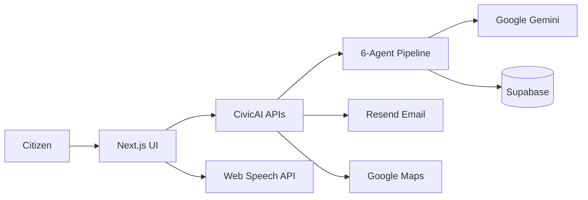
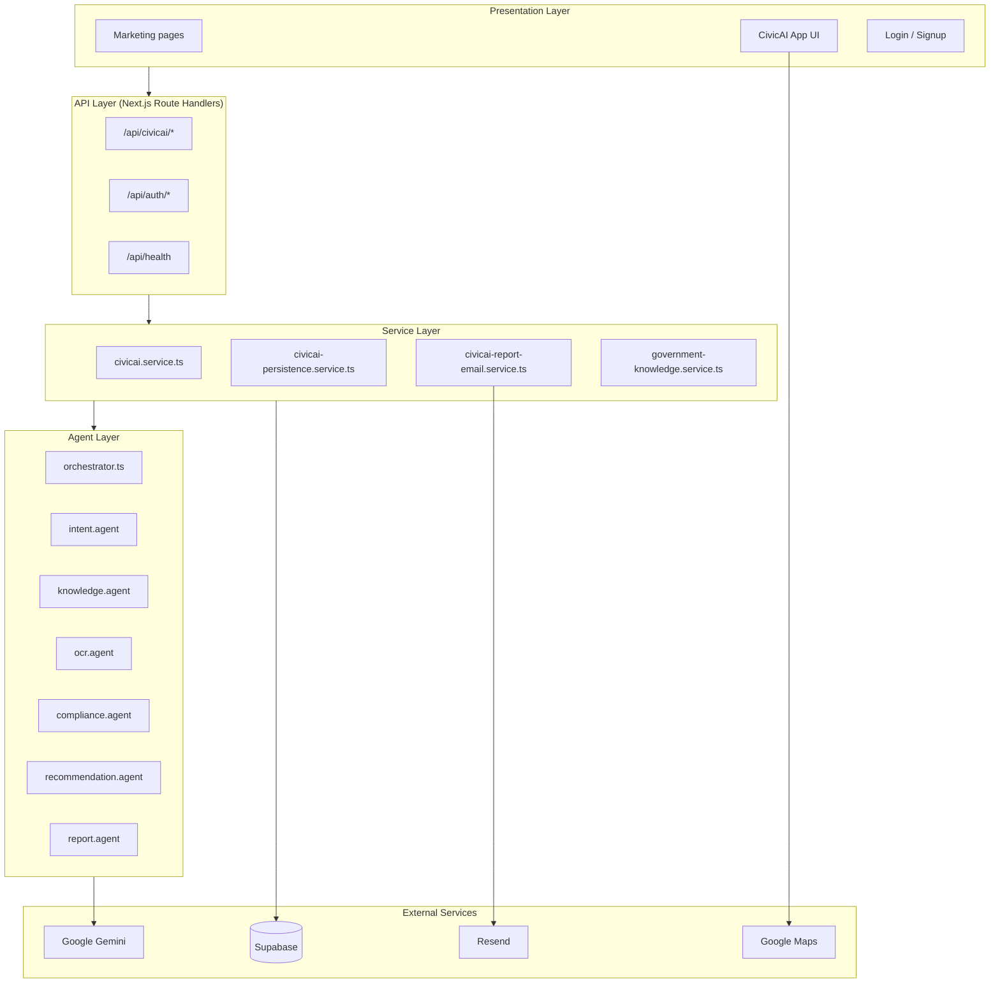
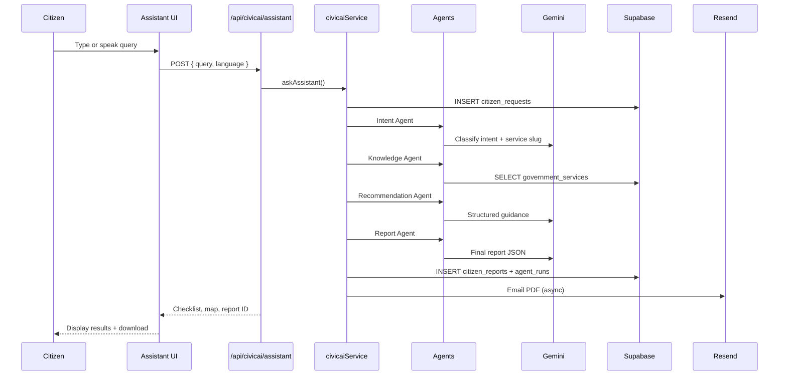
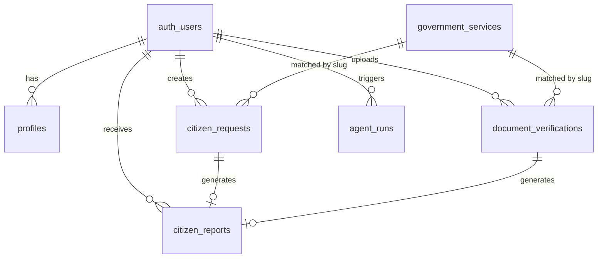
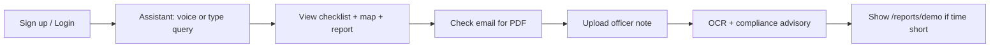

# EcoMind AI — Pakistan's Intelligent Waste Command Center

**Complete Project Documentation**

| Field | Value |
| --- | --- |
| **Product name** | EcoMind AI — Pakistan's Intelligent Waste Command Center |
| **Tagline** | AI that doesn't just report waste—it predicts, prioritizes, and coordinates cleanup. |
| **Version** | 1.0.0 (Hackathon / Phase 1) |
| **Repository folder** | `ai-engineering-framework` (built on AEF v1.0 template) |
| **Primary stack** | Next.js 16 · TypeScript · Supabase · Google Gemini · Resend |

---

## Table of Contents

1. [Executive Summary](#1-executive-summary)
2. [Problem Statement](#2-problem-statement)
3. [Solution Overview](#3-solution-overview)
4. [Complete Technology Stack](#4-complete-technology-stack)
5. [System Architecture](#5-system-architecture)
6. [AI Agent System](#6-ai-agent-system)
7. [Database & Data Model](#7-database--data-model)
8. [API Reference (CivicAI)](#8-api-reference-civicai)
9. [Frontend Application](#9-frontend-application)
10. [Core Features](#10-core-features)
11. [Integrations (Detailed)](#11-integrations-detailed)
12. [Environment Variables](#12-environment-variables)
13. [Setup & Local Development](#13-setup--local-development)
14. [Deployment](#14-deployment)
15. [Security, Privacy & Ethics](#15-security-privacy--ethics)
16. [Hackathon Demo Flow](#16-hackathon-demo-flow)
17. [Project Folder Structure](#17-project-folder-structure)
18. [Testing & Quality](#18-testing--quality)
19. [Known Limitations](#19-known-limitations)
20. [Related Documentation](#20-related-documentation)

---

## 1. Executive Summary

**EcoMind AI** is an AI **Decision Assistant** (not a chatbot) that helps Pakistani citizens report waste and environmental issues with structured, trustworthy guidance.

Citizens can:

- Report issues in **English or Urdu** (typed or via **voice input**)
- Receive authority guidance: responsible department, evidence checklists, response times, safety tips
- Upload **waste photos or municipal notices** for OCR + compliance comparison
- View **municipal facilities and pollution hotspots on Google Maps**
- Download a **PDF incident report** and receive it by **email**

All AI outputs are grounded in a **verified environmental knowledge base** (Supabase) where possible, validated through a **six-agent pipeline**, and persisted for auditability.



---

## 2. Problem Statement

Pakistan has dozens of government services that ordinary citizens struggle to navigate. Common pain points:

| Pain Point | Impact |
| --- | --- |
| Unknown required documents | Repeated office visits, wasted time |
| Unclear official fees | Overpayment to middlemen |
| Unfamiliar procedures | Dependence on agents and facilitators |
| Officer requests extra documents | Citizens cannot verify legitimacy |
| Scam warnings absent | Unofficial payments accepted unknowingly |

**CivicAI** reduces information asymmetry by giving citizens structured, official-style guidance before and during their visit.

---

## 3. Solution Overview

CivicAI provides two authenticated AI workflows:

| Workflow | User action | Pipeline | Output |
| --- | --- | --- | --- |
| **Query Pipeline** | Type or speak a question | Intent → Knowledge → Recommendation → Report | Checklist, guidance, map, PDF, email |
| **Upload Pipeline** | Upload handwritten officer note | Knowledge → OCR → Compliance → Report | Document comparison, advisory, PDF, email |

### Design principles

| Principle | How CivicAI implements it |
| --- | --- |
| Not a chatbot | Structured JSON outputs, checklists, reports — not open-ended conversation |
| Ground truth first | `KnowledgeAgent` reads `government_services` table before LLM reasoning |
| Never accuse officials | Compliance agent uses polite, advisory language only |
| Auditable AI | Every agent run logged to `agent_runs` |
| Auth everywhere | All CivicAI APIs require Supabase session |
| Bilingual | English + Urdu UI and prompts |

---

## 4. Complete Technology Stack

### 4.1 Core application

| Technology | Version | Role in CivicAI | Why we use it |
| --- | --- | --- | --- |
| **Next.js** | 16.2.9 | Full-stack React framework, App Router, API routes, SSR/SSG | Production-ready routing, API colocation, Vercel deployment |
| **React** | 19.2.4 | UI component library | Industry standard, large ecosystem |
| **TypeScript** | 5.x | Type safety across frontend, API, agents, services | Fewer runtime bugs, better IDE support |
| **Tailwind CSS** | 4.x | Utility-first styling | Fast UI development, consistent design tokens |
| **shadcn/ui** | 4.x | Accessible UI primitives (Button, Card, Dialog, Sidebar, etc.) | Polished components without heavy UI framework lock-in |
| **@base-ui/react** | 1.6.x | Headless primitives (used by shadcn) | Accessible, unstyled building blocks |
| **next-themes** | 0.4.x | Dark / light mode | User preference, demo polish |
| **Framer Motion** | 12.x | Landing page animations | Premium marketing feel |
| **Lucide React** | 1.22.x | Icons across UI | Consistent icon set |
| **React Hook Form** | 7.x | Settings and form state | Performant forms with validation |
| **Zod** | 4.x | Request validation, agent I/O schemas | Runtime + compile-time safety |
| **@hookform/resolvers** | 5.x | Zod ↔ React Hook Form bridge | Form validation integration |
| **Sonner** | 2.x | Toast notifications | User feedback for actions |
| **Recharts** | 3.x | Dashboard charts | Stats visualization |
| **date-fns** | 4.x | Date formatting | Lightweight date utilities |
| **clsx** + **tailwind-merge** | — | Conditional CSS class merging | Clean component styling |
| **class-variance-authority** | 0.7.x | Component variants (shadcn pattern) | Reusable styled components |
| **cmdk** | 1.x | Command palette pattern | UI search/command patterns |
| **vaul** | 1.x | Drawer component | Mobile-friendly panels |
| **uuid** | 14.x | Unique IDs in agent runs | Traceability |

### 4.2 AI & agents

| Technology | Version | Role in CivicAI | Why we use it |
| --- | --- | --- | --- |
| **Google Gemini API** | via `@google/generative-ai` 0.24.x | Intent, OCR (vision), compliance, recommendation, report generation | Multimodal (text + image), JSON mode, strong reasoning |
| **Custom agent framework** | AEF `BaseAgent` | Six specialized CivicAI agents + orchestrator | Structured pipelines, Zod validation, audit logs |
| **Prompt templates** | `prompts/templates/civic/` | System prompts per agent | Maintainable, versioned prompt engineering |
| **Gemini retry layer** | `lib/gemini-retry.ts` | Handles 503/429, model fallbacks | Resilience during high API demand |

**Default model:** `GEMINI_MODEL=gemini-flash-latest`  
**Fallback models:** `GEMINI_FALLBACK_MODELS=gemini-2.0-flash,gemini-flash-latest`

### 4.3 Database, auth & storage

| Technology | Version | Role in CivicAI | Why we use it |
| --- | --- | --- | --- |
| **Supabase** | Cloud | Hosted Postgres + Auth + Storage | Fast setup, RLS, real-time ready |
| **@supabase/supabase-js** | 2.108.x | Server/client Supabase client | Official SDK |
| **@supabase/ssr** | 0.12.x | Cookie-based auth in Next.js | Secure session handling in App Router |
| **PostgreSQL** | via Supabase | `government_services`, `citizen_requests`, `citizen_reports`, `document_verifications`, `agent_runs` | Relational data, JSONB for flexible agent output |
| **Row Level Security (RLS)** | Supabase | Users only see their own data | Security by default |
| **Supabase Storage** | `civicai-documents` bucket | Uploaded officer notes / images | Private per-user file storage |

**Migrations:**

| File | Purpose |
| --- | --- |
| `supabase/migrations/00001` – `00003` | Base AEF schema (profiles, incidents, etc.) |
| `supabase/migrations/00004_civicai.sql` | CivicAI tables, RLS, storage bucket |
| `supabase/migrations/00005_civicai_seed.sql` | Mock government services seed data |

### 4.4 Email & notifications

| Technology | Version | Role in CivicAI | Why we use it |
| --- | --- | --- | --- |
| **Resend** | 6.x (`resend` npm package) | Send report-ready emails with PDF attachment | Simple API, good deliverability for demos |
| **HTML email templates** | `lib/email/templates.ts` | Branded CivicAI report emails | Consistent notification UX |

### 4.5 Maps & location

| Technology | Version | Role in CivicAI | Why we use it |
| --- | --- | --- | --- |
| **Google Maps JavaScript API** | via `@vis.gl/react-google-maps` 1.9.x | Office location maps on reports and services pages | Familiar map UX for citizens |
| **Office location resolver** | `lib/civicai/office-locations.ts` | City-aware office pins from query/service | Contextual guidance |

### 4.6 Voice input

| Technology | Role in CivicAI | Why we use it |
| --- | --- | --- |
| **Web Speech API** | Browser-native speech-to-text (`hooks/use-speech-recognition.ts`) | Free, no extra API key; works in Chrome/Edge |
| **Languages** | `en-PK`, `ur-PK` locale codes | Pakistani English and Urdu voice input |

> Voice transcription runs in the browser. The transcribed text is sent to Gemini only when the user clicks **Send**.

### 4.7 PDF generation

| Technology | Version | Role in CivicAI | Why we use it |
| --- | --- | --- | --- |
| **jsPDF** | 4.x | Client/server PDF report generation | Lightweight PDF without external service |
| **Generator** | `lib/civicai/generate-pdf.ts` | Branded CivicAI PDF with checklist, fees, warnings | Downloadable citizen report |

### 4.8 DevOps, testing & code quality

| Technology | Version | Role |
| --- | --- | --- |
| **Vercel** | — | Recommended production hosting for Next.js |
| **ESLint** | 9.x | Linting (`eslint-config-next`) |
| **Prettier** | 3.x | Code formatting |
| **Husky** | 9.x | Git pre-commit hooks |
| **lint-staged** | 16.x | Run lint/format on staged files |
| **Vitest** | 4.x | Unit tests |
| **Playwright** | 1.61.x | End-to-end smoke tests |
| **Testing Library** | React 16.x | Component unit tests |

### 4.8 What we do **not** use (clarifications)

| Mentioned in early specs | Actual implementation |
| --- | --- |
| OpenRouter | **Not used** — direct Google Gemini API |
| Separate OCR service (Tesseract, etc.) | **Gemini Vision** via OCR agent |
| Paid voice API | **Web Speech API** (browser-native) |
| n8n automation | **Removed** — CivicAI uses Resend email only |

---

## 5. System Architecture

### 5.1 Layered architecture



### 5.2 Request lifecycle (Query Pipeline)



---

## 6. AI Agent System

### 6.1 Agent registry

| # | Agent | File | Uses LLM? | Purpose |
| --- | --- | --- | --- | --- |
| 1 | **Intent** | `agents/intent.agent.ts` | Yes | Detect service intent, language, confidence, entities |
| 2 | **Knowledge** | `agents/knowledge.agent.ts` | **No** | Fetch verified data from `government_services` |
| 3 | **OCR** | `agents/ocr.agent.ts` | Yes (Vision) | Extract document names from uploaded images |
| 4 | **Compliance** | `agents/compliance.agent.ts` | Yes | Compare extracted docs vs official checklist |
| 5 | **Recommendation** | `agents/recommendation.agent.ts` | Yes | Steps, tips, scam warnings, timeline |
| 6 | **Report** | `agents/report.agent.ts` | Yes | Final structured citizen report |

**Schemas:** `agents/civicai-schemas.ts` (Zod)  
**Orchestration:** `agents/orchestrator.ts`  
**Service wiring:** `services/civicai.service.ts`

### 6.2 Confidence thresholds

| Check | Threshold | Behavior if failed |
| --- | --- | --- |
| Intent confidence | ≥ 60% | Return clarification request (422) |
| OCR confidence | ≥ 50% | Warn user, continue with caution |
| Unknown service slug | `unknown` | Ask citizen to rephrase |

### 6.3 Prompt templates

Located in `prompts/templates/civic/`:

| Template ID | Agent |
| --- | --- |
| `civic.intent` | Intent |
| `civic.ocr` | OCR |
| `civic.compliance` | Compliance |
| `civic.recommendation` | Recommendation |
| `civic.report` | Report |
| `civic.procedure` | Procedure guidance (shared) |

See **[CIVICAI-PROMPTS.md](./CIVICAI-PROMPTS.md)** for full prompt documentation.

---

## 7. Database & Data Model

### 7.1 Entity relationship



### 7.2 Tables (CivicAI-specific)

| Table | Description | Key columns |
| --- | --- | --- |
| `government_services` | Verified mock government knowledge | `slug`, `name`, `fee`, `documents`, `warnings`, `instructions` |
| `citizen_requests` | Query pipeline records | `query`, `language`, `service_slug`, `confidence`, `status` |
| `document_verifications` | Upload pipeline records | `storage_path`, `ocr_result`, `compliance_result` |
| `citizen_reports` | Generated reports (JSON + summary) | `report_json`, `service_slug`, `summary` |
| `agent_runs` | Audit trail per agent execution | `agent_name`, `input`, `output`, `duration_ms` |
| `profiles` | User profile + `preferred_language` | Extended for CivicAI |

### 7.3 Seeded government services

Mock data in `00005_civicai_seed.sql` includes:

- Driving License Renewal
- Passport Application
- CNIC / NICOP
- Birth Certificate
- Death Certificate
- Marriage Certificate
- (and additional services per seed file)

> **Note:** Fee and timeline data is **demonstration mock data** for the hackathon, not live government API data.

### 7.4 Storage

| Bucket | Access | Purpose |
| --- | --- | --- |
| `civicai-documents` | Private, per-user folder (`{user_id}/...`) | Officer note images for OCR pipeline |

---

## 8. API Reference (CivicAI)

All CivicAI routes require **authenticated** Supabase session unless noted.

| Method | Endpoint | Description |
| --- | --- | --- |
| `POST` | `/api/civicai/assistant` | Run query pipeline (intent → report) |
| `POST` | `/api/civicai/verify-document` | Run upload pipeline (OCR → compliance) |
| `GET` | `/api/civicai/reports/[id]` | Fetch a citizen report by ID |
| `GET` | `/api/civicai/history` | User's past requests and verifications |
| `GET` | `/api/civicai/services` | List government services from DB |
| `GET` | `/api/civicai/stats` | Dashboard statistics |
| `GET` | `/api/health` | Health check (`product: CivicAI — Pakistan Citizen Assistant`) |

**Auth routes:** `/api/auth/signin`, `/api/auth/signup`, `/api/auth/signout`, `/api/auth/session`

See also: **[CIVICAI-WORKFLOWS.md](./CIVICAI-WORKFLOWS.md)** and **[API-REFERENCE.md](./API-REFERENCE.md)**

---

## 9. Frontend Application

### 9.1 Public marketing pages

| Route | Page |
| --- | --- |
| `/` | Landing page (hero, features, testimonials, CTA) |
| `/features` | Feature breakdown |
| `/how-it-works` | 5-step citizen journey |
| `/about` | About CivicAI |
| `/faq` | Frequently asked questions |
| `/privacy` | Privacy policy |
| `/contact` | Contact form |

### 9.2 Authenticated app pages

| Route | Page |
| --- | --- |
| `/login`, `/signup` | Authentication |
| `/dashboard` | Citizen dashboard overview |
| `/assistant` | AI assistant (text + voice input) |
| `/services` | Browse government services + map |
| `/upload` | Document verification upload |
| `/checklist` | Document checklist from last query |
| `/reports/[id]` | Full report view + PDF download |
| `/reports/demo` | Demo report (for judges) |
| `/history` | Past queries and verifications |
| `/settings` | Language, theme, notification prefs |

### 9.3 Key UI components

| Component | Path | Purpose |
| --- | --- | --- |
| Chat interface | `components/civicai/assistant/chat-interface.tsx` | Main AI assistant UX |
| Document upload | `components/civicai/upload/document-upload.tsx` | Officer note upload |
| Report view | `components/civicai/report/report-view.tsx` | Structured report display |
| OCR panel | `components/civicai/report/ocr-intelligence-panel.tsx` | OCR extraction details |
| Office map | `components/civicai/maps/office-map.tsx` | Google Maps embed |
| App shell | `components/civicai/layout/app-shell.tsx` | Sidebar navigation |
| Language provider | `components/providers/civic-language-provider.tsx` | EN / UR switching |

---

## 10. Core Features

### 10.1 AI civic guidance (Query Pipeline)

- Natural language questions in English or Urdu
- Voice input via Web Speech API
- Structured response: service name, department, fee, processing time
- Document checklist with status chips
- Scam warnings and preparation tips
- Office location on map (city-aware)
- PDF report generation
- Email delivery with PDF attachment

### 10.2 Document verification (Upload Pipeline)

- Upload officer handwritten note (image)
- Gemini Vision OCR extracts requested document names
- Compliance agent compares against official checklist
- Classifies documents: Required / Optional / Unknown
- Polite advisory language (never accuses officials)
- OCR intelligence panel on report page

### 10.3 Citizen dashboard & history

- Stats overview (requests, reports, services used)
- Full history of past queries and verifications
- Re-open reports from history

### 10.4 Bilingual support

- UI labels in English and Urdu
- Language stored in `profiles.preferred_language`
- Voice locales: `en-PK`, `ur-PK`

### 10.5 Branding

Centralized in `lib/civicai/brand.ts`:

- **Product name:** EcoMind AI
- **Full title:** EcoMind AI — Pakistan's Intelligent Waste Command Center
- Used in metadata, emails, PDFs, auth pages

---

## 11. Integrations (Detailed)

### 11.1 Google Gemini

| Use case | Model capability | Implementation |
| --- | --- | --- |
| Intent classification | Text → JSON | `intent.agent.ts` |
| OCR | Vision (image → text) | `ocr.agent.ts` |
| Compliance analysis | Text → JSON | `compliance.agent.ts` |
| Recommendations | Text → JSON | `recommendation.agent.ts` |
| Report synthesis | Text → JSON | `report.agent.ts` |

**Configuration:** `GEMINI_API_KEY`, `GEMINI_MODEL`, `GEMINI_FALLBACK_MODELS`  
**Resilience:** `lib/gemini-retry.ts` retries on 503/429 and skips invalid models (404)

### 11.2 Supabase

| Feature | CivicAI usage |
| --- | --- |
| Auth | Email/password signup, session cookies |
| Database | Government knowledge + citizen data |
| RLS | Per-user data isolation |
| Storage | Private document uploads |
| Migrations | Versioned SQL in `supabase/migrations/` |

### 11.3 Resend (Email)

| Feature | Detail |
| --- | --- |
| Trigger | After report is saved |
| Template | `civicai.report.ready` in `lib/email/templates.ts` |
| Attachment | PDF generated by `lib/civicai/generate-pdf.ts` |
| Subject | `[CivicAI] Your {serviceName} report is ready` |

**Configuration:** `RESEND_API_KEY`, `RESEND_FROM_EMAIL`  
**Free tier note:** Resend sandbox only sends to verified email addresses.

### 11.4 Google Maps

| Feature | Detail |
| --- | --- |
| Library | `@vis.gl/react-google-maps` |
| Provider | `components/civicai/maps/google-maps-provider.tsx` |
| Locations | `lib/civicai/office-locations.ts` |
| Key | `NEXT_PUBLIC_GOOGLE_MAPS_API_KEY` |

### 11.5 Web Speech API

| Feature | Detail |
| --- | --- |
| Hook | `hooks/use-speech-recognition.ts` |
| Browsers | Chrome, Edge (recommended) |
| Cost | Free (browser-native) |
| Flow | Mic → transcript in input → user clicks Send → Gemini |

### 11.6 jsPDF

| Feature | Detail |
| --- | --- |
| Generator | `lib/civicai/generate-pdf.ts` |
| Contents | Header, service info, checklist, warnings, fees, footer |
| Download | Report page + email attachment |

---

## 12. Environment Variables

Copy `.env.example` to `.env.local` and fill in values.

| Variable | Required | Description |
| --- | --- | --- |
| `NEXT_PUBLIC_APP_URL` | Yes | App URL (e.g. `http://localhost:3000`) |
| `NEXT_PUBLIC_APP_NAME` | Yes | Display name (`CivicAI — Pakistan Citizen Assistant`) |
| `NEXT_PUBLIC_SUPABASE_URL` | Yes | Supabase project URL |
| `NEXT_PUBLIC_SUPABASE_ANON_KEY` | Yes | Supabase anon key (client-safe) |
| `SUPABASE_SERVICE_ROLE_KEY` | Yes | Server-side Supabase key (keep secret) |
| `GEMINI_API_KEY` | Yes | Google AI Studio / Gemini API key |
| `GEMINI_MODEL` | Yes | Primary model (e.g. `gemini-flash-latest`) |
| `GEMINI_FALLBACK_MODELS` | Optional | Comma-separated fallback models |
| `NEXT_PUBLIC_GOOGLE_MAPS_API_KEY` | Yes* | Google Maps JavaScript API key |
| `RESEND_API_KEY` | Optional | Resend API key for email |
| `RESEND_FROM_EMAIL` | Optional | Sender address (e.g. `onboarding@resend.dev`) |
| `CIVIC_PROMPT_PACK` | Optional | Legacy AEF prompt pack selector |
| `CIVIC_ALERT_EMAIL` | Optional | Alert escalation email |

\*Required for map features; app works without maps if omitted.

> **Security:** Never commit `.env.local` to Git. It is listed in `.gitignore`.

---

## 13. Setup & Local Development

### 13.1 Prerequisites

- Node.js 20+
- npm
- Supabase account (free tier works)
- Google AI Studio account (Gemini API key)
- Google Cloud project (Maps JavaScript API) — for maps
- Resend account — for email (optional for local dev)

### 13.2 Installation

```bash
cd ai-engineering-framework
cp .env.example .env.local
npm install
```

### 13.3 Supabase setup

1. Create a Supabase project at [supabase.com](https://supabase.com)
2. Run migrations in order: `00001` → `00005` (SQL Editor or Supabase CLI)
3. Copy project URL and keys to `.env.local`
4. Enable Email auth in Supabase Authentication settings
5. Add redirect URL: `http://localhost:3000/auth/callback`

### 13.4 Run locally

```bash
npm run dev
```

Open [http://localhost:3000](http://localhost:3000)

### 13.5 Useful scripts

| Command | Description |
| --- | --- |
| `npm run dev` | Start development server |
| `npm run build` | Production build |
| `npm run lint` | ESLint |
| `npm run test` | Vitest unit tests |
| `npm run test:e2e` | Playwright E2E tests |
| `npm run format` | Prettier format |

---

## 14. Deployment

### 14.1 Recommended: Vercel

1. Push repo to GitHub
2. Import project in [Vercel](https://vercel.com)
3. Add all environment variables from `.env.local`
4. Set `NEXT_PUBLIC_APP_URL` to production URL
5. Add production URL to Supabase auth redirect URLs
6. Deploy

### 14.2 Post-deploy checklist

- [ ] Supabase migrations applied on production project
- [ ] Gemini API key has billing/quota enabled
- [ ] Google Maps API key restricted to your domain
- [ ] Resend domain verified (for production email)
- [ ] `NEXT_PUBLIC_APP_NAME` set to CivicAI branding

---

## 15. Security, Privacy & Ethics

### 15.1 Security

| Measure | Implementation |
| --- | --- |
| Authentication | Supabase Auth on all CivicAI routes |
| Authorization | Row Level Security on all citizen tables |
| File isolation | Storage paths scoped to `user_id` |
| Rate limiting | AI endpoints rate-limited per user |
| Secrets | Server-only env vars, never exposed to client |
| Input validation | Zod schemas on all API bodies |

### 15.2 Privacy

- Citizen queries and uploads stored per-user in Supabase
- Documents stored in private storage bucket
- No data sold or shared with third parties (demo/hackathon scope)
- See `/privacy` page for citizen-facing policy

### 15.3 Ethical AI guidelines

| Rule | CivicAI behavior |
| --- | --- |
| Never accuse officials | Compliance output is advisory only |
| Ground in verified data | Knowledge agent reads DB first |
| Transparent limitations | Mock government data disclaimer on reports |
| Scam awareness | Warnings included in every recommendation |
| Human oversight | Reports are guidance, not legal advice |

---

## 16. Hackathon Demo Flow

Recommended 3-minute judge demo:



### Demo script

1. **Landing** — Show tagline and "AI Decision Assistant — Not a Chatbot"
2. **Sign up** — Create citizen account
3. **Assistant** — Ask: *"I want to renew my driving license in Lahore"*
4. **Results** — Show fee (PKR 1,800), checklist, scam warning, map
5. **Report** — Open report page, download PDF
6. **Email** — Show inbox with CivicAI report email + attachment
7. **Upload** (optional) — Upload sample officer note, show OCR comparison
8. **Architecture** — Mention 6-agent pipeline + Supabase grounding

### Judge WOW factors

- Voice input in Urdu/English (free, no extra API)
- Document verification against official checklist
- PDF + email delivery
- Google Maps office guidance
- Full audit trail in `agent_runs`
- Bilingual citizen experience

---

## 17. Project Folder Structure

```
ai-engineering-framework/
├── agents/                    # AI agents (intent, ocr, compliance, etc.)
│   ├── civicai-schemas.ts     # Zod schemas for all agent I/O
│   ├── orchestrator.ts        # Agent execution coordinator
│   └── *.agent.ts             # Individual agent implementations
├── app/
│   ├── (auth)/                # Login, signup
│   ├── (civicai)/             # Authenticated CivicAI app pages
│   ├── (marketing)/           # Public landing & info pages
│   └── api/civicai/           # CivicAI REST API routes
├── components/civicai/        # CivicAI UI components
├── docs/
│   ├── CIVICAI-PROJECT-DOCUMENTATION.md  # This file
│   ├── CIVICAI-AGENT-ARCHITECTURE.md
│   ├── CIVICAI-WORKFLOWS.md
│   ├── CIVICAI-PROMPTS.md
│   └── CIVICAI-EXAMPLES.md
├── hooks/
│   ├── use-speech-recognition.ts
│   └── use-has-mounted.ts
├── lib/civicai/               # CivicAI business logic, PDF, maps, brand
├── prompts/templates/civic/   # Gemini prompt templates
├── services/
│   ├── civicai.service.ts     # Main pipeline orchestration
│   ├── civicai-persistence.service.ts
│   ├── civicai-report-email.service.ts
│   └── government-knowledge.service.ts
├── supabase/migrations/       # Database schema + seed
└── tests/                     # Unit + E2E tests
```

---

## 18. Testing & Quality

| Layer | Tool | Location |
| --- | --- | --- |
| Unit tests | Vitest | `tests/unit/` |
| E2E smoke tests | Playwright | `tests/e2e/smoke.spec.ts` |
| Linting | ESLint | `npm run lint` |
| Formatting | Prettier | `npm run format` |
| Pre-commit | Husky + lint-staged | `.husky/` |

---

## 19. Known Limitations

| Limitation | Detail |
| --- | --- |
| Mock government data | Fees/timelines are seeded demo data, not live gov APIs |
| Voice accuracy | Web Speech API quality varies by browser and accent |
| Urdu voice | Roman Urdu/English transcription most reliable; AI understands Urdu on Send |
| Gemini quota | High traffic may hit rate limits; fallbacks configured |
| Resend sandbox | Free tier emails only to verified addresses |
| No mobile app | Web-only (responsive design) |
| No offline mode | Requires internet for AI and auth |

---

## 20. Related Documentation

| Document | Description |
| --- | --- |
| [CIVICAI-AGENT-ARCHITECTURE.md](./CIVICAI-AGENT-ARCHITECTURE.md) | Deep dive into each agent, schemas, diagrams |
| [CIVICAI-WORKFLOWS.md](./CIVICAI-WORKFLOWS.md) | Query & upload pipeline sequences, error codes |
| [CIVICAI-PROMPTS.md](./CIVICAI-PROMPTS.md) | Prompt engineering reference |
| [CIVICAI-EXAMPLES.md](./CIVICAI-EXAMPLES.md) | Sample queries and expected outputs |
| [API-REFERENCE.md](./API-REFERENCE.md) | Full HTTP API reference (all routes) |
| [PHASE_1_PROJECT_SPEC.md](../PHASE_1_PROJECT_SPEC.md) | Original Phase 1 product spec prompt |
| [PROJECT_CONSTITUTION.md](../PROJECT_CONSTITUTION.md) | AEF engineering rules and architecture |

---

## Conclusion

**CivicAI — Pakistan Citizen Assistant** is a production-style hackathon build that combines:

- A **structured six-agent AI pipeline** (Google Gemini)
- **Verified government knowledge** (Supabase PostgreSQL)
- A **modern citizen-facing web app** (Next.js, Tailwind, shadcn/ui)
- **Practical integrations**: email (Resend), maps (Google Maps), voice (Web Speech API), PDF (jsPDF)

It is designed to demonstrate how AI can reduce citizen dependence on middlemen by making government procedures transparent, structured, and accessible — in both English and Urdu.

---

*Document version: 1.0.0 · Last updated: July 2026 · CivicAI Hackathon Build*
