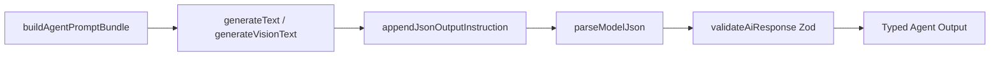

# CivicAI Prompt Engineering Reference

**Version:** 1.0.0  
**Implementation:** `prompts/templates/civic/agents.prompt.ts`, `lib/prompt-manager.ts`, `agents/civicai-schemas.ts`

---

## 1. Overview

CivicAI uses a **versioned prompt registry** with template interpolation (`{{variable}}`). Agents compose prompts via `buildAgentPromptBundle()`, which layers:

1. **Base system** (`base.system`)
2. **Project system** (`project.system`) — project name, environment rules
3. **Agent-specific system parts** (optional `extraSystemParts`)
4. **User template** (e.g. `civic.intent`)
5. **JSON output instruction** (`shared.json-output`) — appended automatically for structured agents

The Knowledge agent has **no prompt template** — it reads directly from `government_services`.

---

## 2. Prompt Template Catalog

| Template ID            | Version | Role   | Agent          | Required Variables                                                                                                        |
| ---------------------- | ------- | ------ | -------------- | ------------------------------------------------------------------------------------------------------------------------- |
| `civic.intent`         | 1.0.0   | user   | Intent         | `query`, `language`, `serviceIndex`, `languageInstruction`                                                                |
| `civic.ocr`            | 1.0.0   | user   | OCR            | `serviceName`, `languageInstruction`                                                                                      |
| `civic.compliance`     | 1.0.0   | user   | Compliance     | `serviceName`, `officialDocuments`, `extractedDocuments`, `languageInstruction`                                           |
| `civic.recommendation` | 1.0.0   | user   | Recommendation | `serviceKnowledge`, `intentSummary`, `languageInstruction`                                                                |
| `civic.report`         | 1.0.0   | user   | Report         | `reportType`, `serviceName`, `intentData`, `knowledgeData`, `recommendationData`, `complianceData`, `languageInstruction` |
| `civic.knowledge`      | —       | —      | Knowledge      | **N/A (DB retrieval)**                                                                                                    |
| `base.system`          | —       | system | All LLM agents | —                                                                                                                         |
| `project.system`       | —       | system | All LLM agents | `projectName`, `environment`                                                                                              |
| `shared.json-output`   | 1.0.0   | user   | All structured | —                                                                                                                         |

---

## 3. System Prompt Composition

### 3.1 Base System (`base.system`)

```
You are an AI assistant operating inside the AI Engineering Framework (AEF).
Follow project architecture, keep responses actionable, and prefer structured output when requested.
```

### 3.2 Project System (`project.system`)

```
Project: {{projectName}}
Environment: {{environment}}

Rules:
- Be precise and production-minded.
- Never invent credentials, URLs, or database records.
- When uncertain, state assumptions clearly.
- Prefer safe defaults for disaster-response and civic use cases.
```

**CivicAI runtime context:**

```json
{
  "projectName": "CivicAI — Pakistan Citizen Assistant",
  "environment": "development | production"
}
```

### 3.3 Agent-Specific System Extensions

| Agent          | Extra System Instruction                                                                           |
| -------------- | -------------------------------------------------------------------------------------------------- |
| Intent         | _"You are the Intent Agent. Return structured JSON only. Never invent services not in the index."_ |
| Compliance     | _"You are the Compliance Agent. Use polite, careful wording. Never accuse government officials."_  |
| OCR            | _(none — template-only)_                                                                           |
| Recommendation | _(none — template-only)_                                                                           |
| Report         | _(none — template-only)_                                                                           |

### 3.4 Language Instruction

Injected as `{{languageInstruction}}` from `getLanguageInstruction()`:

| Language | Instruction                                                                                                                                                     |
| -------- | --------------------------------------------------------------------------------------------------------------------------------------------------------------- |
| `en`     | _"Respond in clear, simple English suitable for Pakistani citizens."_                                                                                           |
| `ur`     | _"Respond in Urdu (اردو). Use simple, respectful language suitable for Pakistani citizens. Keep official terms (CNIC, NADRA, etc.) in English where standard."_ |

---

## 4. User Prompt Templates

### 4.1 `civic.intent` (v1.0.0)

```
Analyze this Pakistani citizen query about government services.

Query: {{query}}
User language preference: {{language}}

Available services (slug | name):
{{serviceIndex}}

{{languageInstruction}}

Return JSON:
- detectedLanguage: en | ur
- translatedQuery: English translation if query is Urdu, else same query
- intent: short intent label (e.g. "license_renewal", "passport_application")
- serviceSlug: best matching slug from index, or "unknown"
- serviceName: matched service name
- entities: array of extracted entities (locations, document names, dates)
- confidence: 0-100
- needsClarification: boolean
- clarificationQuestion: string if needsClarification else empty
```

**Temperature:** `0.2`

---

### 4.2 `civic.knowledge` — Database Retrieval (No Prompt)

Knowledge is **not LLM-generated**. The Knowledge agent calls:

```
governmentKnowledgeService.getBySlug(serviceSlug)
  → SELECT * FROM government_services WHERE slug = $1
  → mapDbToKnowledge() → KnowledgeOutput
```

Fallback: in-memory `GOVERNMENT_SERVICES` mock when Supabase unavailable.

---

### 4.3 `civic.ocr` (v1.0.0)

```
Extract all document names from this government office note image.

Service context: {{serviceName}}
{{languageInstruction}}

Normalize document names (e.g. "ID card" → "CNIC").
Return JSON:
- rawText: full extracted text
- documents: array of { name, normalizedName, confidence }
- overallConfidence: 0-100
```

**Temperature:** `0.1`  
**Input modality:** Image (base64) + text prompt via Gemini Vision

---

### 4.4 `civic.compliance` (v1.0.0)

```
Compare officer-requested documents against the official government checklist.

Service: {{serviceName}}
Official documents: {{officialDocuments}}

OCR extracted documents:
{{extractedDocuments}}

{{languageInstruction}}

Rules:
- Never accuse government officials
- Use polite, careful wording
- Classify: required | optional | unknown | missing | verified

Return JSON:
- serviceName
- complianceScore: 0-100
- items: array of { name, status, note }
- missingDocuments: string array
- suspiciousRequests: string array (documents not on official list)
- advisory: polite paragraph for citizen
```

**Temperature:** `0.2`

---

### 4.5 `civic.recommendation` (v1.0.0)

```
Generate citizen guidance for a Pakistan government service.

Service knowledge:
{{serviceKnowledge}}

Citizen intent:
{{intentSummary}}

{{languageInstruction}}

Return JSON:
- checklist: array of { name, status } status = required | optional
- preparationTips: string array
- timeline: array of { step, description, duration }
- faqs: array of { question, answer }
- alternatives: string array
- nextSteps: string array
- warnings: string array (scam prevention, polite tone)
```

**Temperature:** `0.3`

---

### 4.6 `civic.report` (v1.0.0)

```
Assemble a final citizen report from pipeline data.

Report type: {{reportType}}
Service: {{serviceName}}

Intent data: {{intentData}}
Knowledge data: {{knowledgeData}}
Recommendation data: {{recommendationData}}
Compliance data: {{complianceData}}

{{languageInstruction}}

Return JSON:
- citizenSummary: 2-3 paragraph summary for citizen
- printableSections: array of { title, content }
- pdfTitle: string
- pdfSections: array of { heading, body }
- qrData: JSON string for QR code (serviceSlug, reportDate, checklist count)
- metadata: { serviceName, department, fee, processingTime, confidence }
```

**Temperature:** `0.3`

---

## 5. Structured Output Format

CivicAI does **not** use native Gemini function calling. Instead it uses **prompt-constrained JSON + Zod validation**.

### 5.1 JSON Output Instruction (`shared.json-output`)

Appended to every structured agent prompt via `appendJsonOutputInstruction()`:

```
Respond with valid JSON only. Do not include markdown fences, commentary, or trailing text.
```

### 5.2 Processing Pipeline



### 5.3 Function-Calling Equivalent

For integrators expecting OpenAI-style function calling, map as follows:

| Concept                       | CivicAI Implementation               |
| ----------------------------- | ------------------------------------ |
| `tools[].function.name`       | Agent name (`intent`, `ocr`, etc.)   |
| `tools[].function.parameters` | Zod input schema (see §6)            |
| `tool_choice`                 | Implicit — always structured output  |
| Response                      | Zod-validated output schema (see §6) |
| System message                | `buildSystemPrompt()` + extra parts  |

**Example invocation pattern (conceptual):**

```json
{
  "model": "gemini-default",
  "systemInstruction": "<composed system prompt>",
  "contents": [{ "role": "user", "parts": [{ "text": "<resolved template>" }] }],
  "generationConfig": { "temperature": 0.2 },
  "responseFormat": "json_via_prompt + zod_validation"
}
```

---

## 6. JSON Schemas (Zod → JSON Schema)

Source: `agents/civicai-schemas.ts`

### 6.1 Shared: Document Status

```json
{
  "type": "string",
  "enum": ["required", "optional", "unknown", "missing", "verified"]
}
```

### 6.2 Intent Output Schema

```json
{
  "$id": "civic.intent.output",
  "type": "object",
  "required": [
    "detectedLanguage",
    "translatedQuery",
    "intent",
    "serviceSlug",
    "serviceName",
    "entities",
    "confidence",
    "needsClarification",
    "clarificationQuestion"
  ],
  "properties": {
    "detectedLanguage": { "type": "string", "enum": ["en", "ur"] },
    "translatedQuery": { "type": "string" },
    "intent": { "type": "string" },
    "serviceSlug": { "type": "string" },
    "serviceName": { "type": "string" },
    "entities": { "type": "array", "items": { "type": "string" } },
    "confidence": { "type": "number", "minimum": 0, "maximum": 100 },
    "needsClarification": { "type": "boolean" },
    "clarificationQuestion": { "type": "string" }
  }
}
```

**Input schema:**

```json
{
  "$id": "civic.intent.input",
  "type": "object",
  "required": ["query"],
  "properties": {
    "query": { "type": "string", "minLength": 1 },
    "language": { "type": "string", "enum": ["en", "ur"], "default": "en" }
  }
}
```

---

### 6.3 Knowledge Output Schema

```json
{
  "$id": "civic.knowledge.output",
  "type": "object",
  "required": [
    "serviceSlug",
    "serviceName",
    "category",
    "department",
    "fee",
    "processingTime",
    "documents",
    "warnings",
    "instructions",
    "description"
  ],
  "properties": {
    "serviceSlug": { "type": "string" },
    "serviceName": { "type": "string" },
    "category": { "type": "string" },
    "department": { "type": "string" },
    "officeName": { "type": ["string", "null"] },
    "officeAddress": { "type": ["string", "null"] },
    "fee": { "type": "string" },
    "processingTime": { "type": "string" },
    "documents": { "type": "array", "items": { "type": "string" } },
    "warnings": { "type": "array", "items": { "type": "string" } },
    "instructions": { "type": "array", "items": { "type": "string" } },
    "description": { "type": "string" }
  }
}
```

**Input schema:**

```json
{
  "$id": "civic.knowledge.input",
  "type": "object",
  "required": ["serviceSlug"],
  "properties": {
    "serviceSlug": { "type": "string", "minLength": 1 }
  }
}
```

---

### 6.4 OCR Output Schema

```json
{
  "$id": "civic.ocr.output",
  "type": "object",
  "required": ["rawText", "documents", "overallConfidence"],
  "properties": {
    "rawText": { "type": "string" },
    "documents": {
      "type": "array",
      "items": {
        "type": "object",
        "required": ["name", "normalizedName", "confidence"],
        "properties": {
          "name": { "type": "string" },
          "normalizedName": { "type": "string" },
          "confidence": { "type": "number", "minimum": 0, "maximum": 100 }
        }
      }
    },
    "overallConfidence": { "type": "number", "minimum": 0, "maximum": 100 }
  }
}
```

**Input schema:**

```json
{
  "$id": "civic.ocr.input",
  "type": "object",
  "required": ["imageBase64", "mimeType"],
  "properties": {
    "imageBase64": { "type": "string", "minLength": 1 },
    "mimeType": { "type": "string", "minLength": 1 },
    "serviceName": { "type": "string", "default": "Government Service" },
    "language": { "type": "string", "enum": ["en", "ur"], "default": "en" }
  }
}
```

---

### 6.5 Compliance Output Schema

```json
{
  "$id": "civic.compliance.output",
  "type": "object",
  "required": [
    "serviceName",
    "complianceScore",
    "items",
    "missingDocuments",
    "suspiciousRequests",
    "advisory"
  ],
  "properties": {
    "serviceName": { "type": "string" },
    "complianceScore": { "type": "number", "minimum": 0, "maximum": 100 },
    "items": {
      "type": "array",
      "items": {
        "type": "object",
        "required": ["name", "status", "note"],
        "properties": {
          "name": { "type": "string" },
          "status": { "$ref": "#/definitions/documentStatus" },
          "note": { "type": "string" }
        }
      }
    },
    "missingDocuments": { "type": "array", "items": { "type": "string" } },
    "suspiciousRequests": { "type": "array", "items": { "type": "string" } },
    "advisory": { "type": "string" }
  }
}
```

---

### 6.6 Recommendation Output Schema

```json
{
  "$id": "civic.recommendation.output",
  "type": "object",
  "required": [
    "checklist",
    "preparationTips",
    "timeline",
    "faqs",
    "alternatives",
    "nextSteps",
    "warnings"
  ],
  "properties": {
    "checklist": {
      "type": "array",
      "items": {
        "type": "object",
        "required": ["name", "status"],
        "properties": {
          "name": { "type": "string" },
          "status": { "$ref": "#/definitions/documentStatus" }
        }
      }
    },
    "preparationTips": { "type": "array", "items": { "type": "string" } },
    "timeline": {
      "type": "array",
      "items": {
        "type": "object",
        "required": ["step", "description"],
        "properties": {
          "step": { "type": "string" },
          "description": { "type": "string" },
          "duration": { "type": "string" }
        }
      }
    },
    "faqs": {
      "type": "array",
      "items": {
        "type": "object",
        "required": ["question", "answer"],
        "properties": {
          "question": { "type": "string" },
          "answer": { "type": "string" }
        }
      }
    },
    "alternatives": { "type": "array", "items": { "type": "string" } },
    "nextSteps": { "type": "array", "items": { "type": "string" } },
    "warnings": { "type": "array", "items": { "type": "string" } }
  }
}
```

---

### 6.7 Report Output Schema

```json
{
  "$id": "civic.report.output",
  "type": "object",
  "required": [
    "citizenSummary",
    "printableSections",
    "pdfTitle",
    "pdfSections",
    "qrData",
    "metadata"
  ],
  "properties": {
    "citizenSummary": { "type": "string" },
    "printableSections": {
      "type": "array",
      "items": {
        "type": "object",
        "required": ["title", "content"],
        "properties": {
          "title": { "type": "string" },
          "content": { "type": "string" }
        }
      }
    },
    "pdfTitle": { "type": "string" },
    "pdfSections": {
      "type": "array",
      "items": {
        "type": "object",
        "required": ["heading", "body"],
        "properties": {
          "heading": { "type": "string" },
          "body": { "type": "string" }
        }
      }
    },
    "qrData": { "type": "string", "description": "JSON string for QR encoding" },
    "metadata": {
      "type": "object",
      "required": ["serviceName", "department", "fee", "processingTime", "confidence"],
      "properties": {
        "serviceName": { "type": "string" },
        "department": { "type": "string" },
        "fee": { "type": "string" },
        "processingTime": { "type": "string" },
        "confidence": { "type": "number" }
      }
    }
  }
}
```

---

## 7. Prompt Bundle Metadata

`buildAgentPromptBundle()` returns metadata for observability:

```json
{
  "system": "<composed system prompt>",
  "user": "<resolved user template>",
  "meta": {
    "systemTemplateIds": ["base.system", "project.system"],
    "userTemplateId": "civic.intent",
    "userVersion": "1.0.0"
  }
}
```

---

## 8. Validation & Error Messages

When Zod validation fails after LLM response:

```
AI response validation failed: <path>: <message>; ...
```

This surfaces as agent execution error → HTTP 422 with agent-specific error code.

Missing prompt variables throw at resolve time:

```
Missing required prompt variables for civic.intent: query, serviceIndex
```

---

## 9. Versioning Policy

| Change Type                     | Action                                  |
| ------------------------------- | --------------------------------------- |
| Template wording (non-breaking) | Bump patch version (1.0.0 → 1.0.1)      |
| New required variable           | Bump minor version; update agent caller |
| Output schema change            | Bump minor version; update Zod schema   |
| Breaking behavior change        | Bump major version; migration notes     |

Templates are registered in `prompts/registry.ts` with tags: `civic`, `intent`, `ocr`, `compliance`, `recommendation`, `report`, `agent`.

---

## 10. Related Documentation

- [CIVICAI-AGENT-ARCHITECTURE.md](./CIVICAI-AGENT-ARCHITECTURE.md)
- [CIVICAI-WORKFLOWS.md](./CIVICAI-WORKFLOWS.md)
- [CIVICAI-EXAMPLES.md](./CIVICAI-EXAMPLES.md)
- [PROMPT_ENGINEERING.md](../PROMPT_ENGINEERING.md) — Framework-wide prompt patterns
