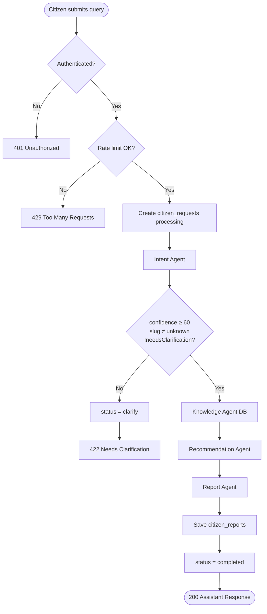
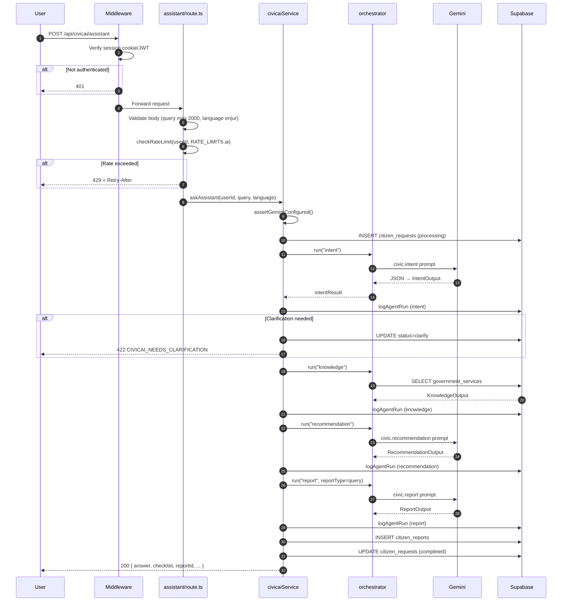
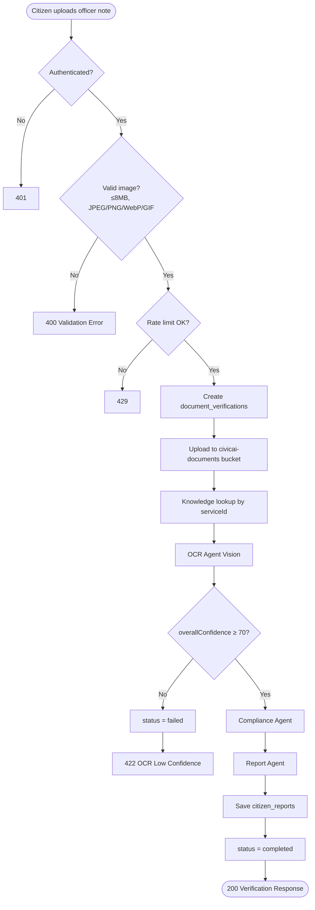
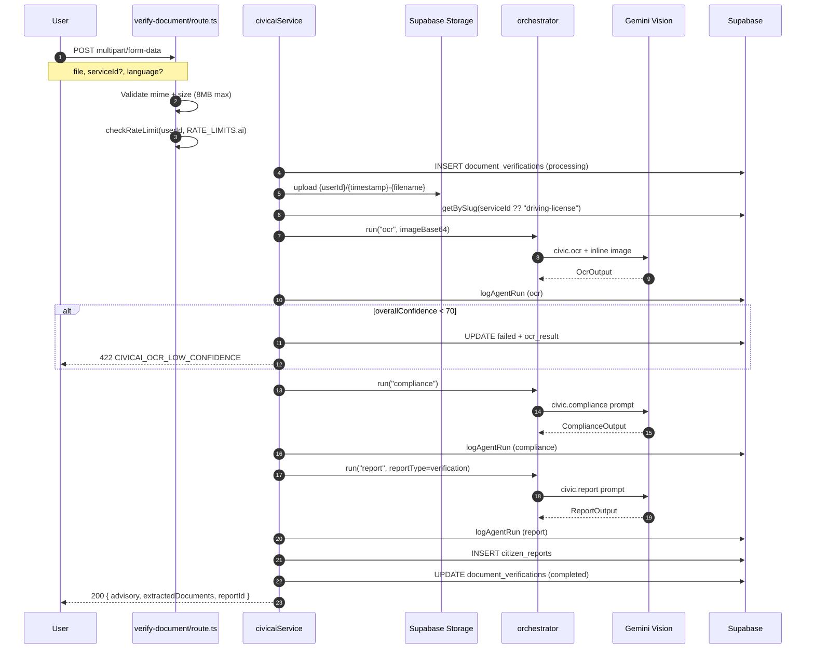
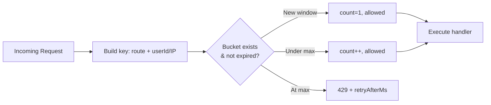
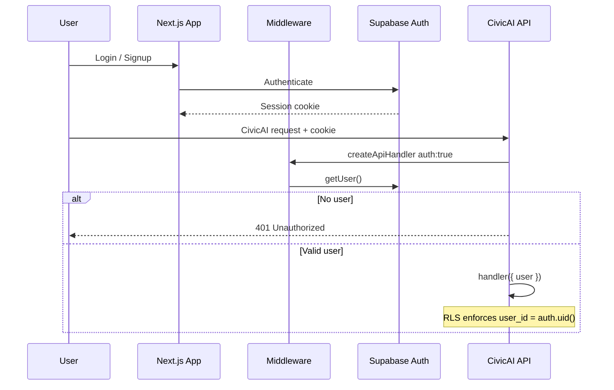
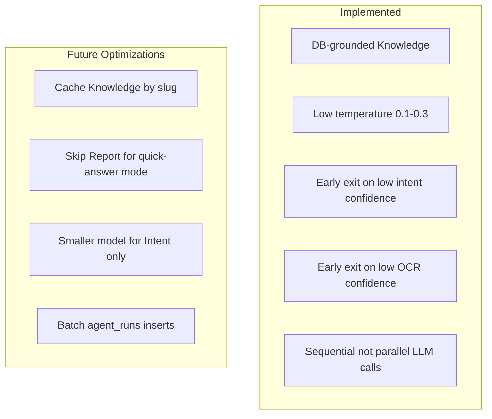
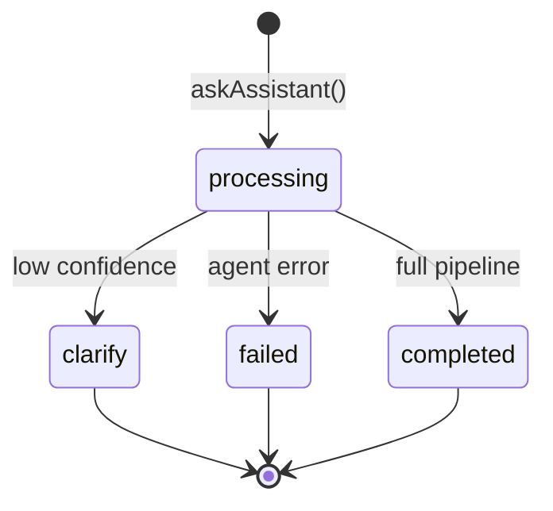
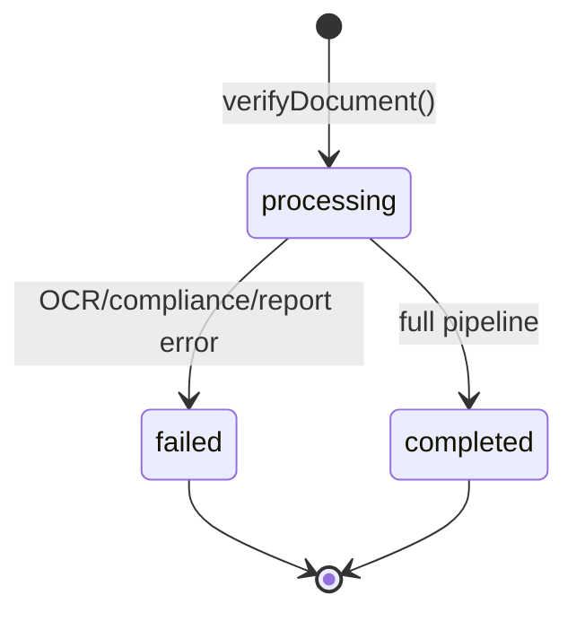

# CivicAI Workflows

**Version:** 1.0.0  
**Implementation:** `services/civicai.service.ts`, `app/api/civicai/*`, `lib/api/rate-limit.ts`

---

## 1. Workflow Overview

CivicAI exposes two primary authenticated workflows:

| Workflow            | Entry Point                         | Agents                                       | Persisted To                                                       |
| ------------------- | ----------------------------------- | -------------------------------------------- | ------------------------------------------------------------------ |
| **Query Pipeline**  | `POST /api/civicai/assistant`       | Intent → Knowledge → Recommendation → Report | `citizen_requests`, `citizen_reports`, `agent_runs`                |
| **Upload Pipeline** | `POST /api/civicai/verify-document` | Knowledge → OCR → Compliance → Report        | `document_verifications`, Storage, `citizen_reports`, `agent_runs` |

Both require **Supabase authentication** (`auth: true` on all routes).

---

## 2. Query Pipeline

### 2.1 High-Level Flow



### 2.2 Detailed Sequence



### 2.3 Request / Response Contract

**Request:**

```json
{
  "query": "I want to renew my driving license",
  "language": "en"
}
```

**Success Response (200):**

```json
{
  "success": true,
  "data": {
    "serviceName": "Driving License Renewal",
    "serviceId": "driving-license",
    "department": "Traffic Police / Licensing Authority",
    "fee": "PKR 1,800",
    "processingTime": "7–14 working days",
    "answer": "<citizenSummary>",
    "confidence": 92,
    "checklist": [{ "name": "CNIC", "status": "required" }],
    "warnings": ["Only pay PKR 1,800 at official counter"],
    "timeline": [{ "step": "1", "description": "Visit licensing center" }],
    "preparationTips": ["..."],
    "nextSteps": ["..."],
    "faqs": [{ "question": "...", "answer": "..." }],
    "reportId": "uuid",
    "report": { "...": "ReportOutput" }
  }
}
```

**Clarification Response (422):**

```json
{
  "success": false,
  "error": {
    "message": "Which service do you need — passport or CNIC?",
    "code": "CIVICAI_NEEDS_CLARIFICATION",
    "details": { "intent": { "...": "IntentOutput" } }
  }
}
```

---

## 3. Upload Pipeline

### 3.1 High-Level Flow



### 3.2 Detailed Sequence



### 3.3 Multipart Request

| Field       | Type          | Required | Default           |
| ----------- | ------------- | -------- | ----------------- |
| `file`      | File (image)  | Yes      | —                 |
| `serviceId` | string (slug) | No       | `driving-license` |
| `language`  | `en` \| `ur`  | No       | `en`              |

---

## 4. Rate Limiting

### 4.1 Configuration

Source: `lib/api/rate-limit.ts`

| Bucket                | Window     | Max Requests | Applied To                                               |
| --------------------- | ---------- | ------------ | -------------------------------------------------------- |
| `RATE_LIMITS.ai`      | 60 seconds | **10**       | `/api/civicai/assistant`, `/api/civicai/verify-document` |
| `RATE_LIMITS.default` | 60 seconds | 60           | History, stats, services, reports                        |
| `RATE_LIMITS.auth`    | 60 seconds | 20           | Sign-in, sign-up, sign-out                               |

### 4.2 Rate Limit Flow



### 4.3 Client Handling

On 429, response includes `retryAfterMs`. Clients should:

1. Display user-friendly "Please wait before trying again"
2. Back off for `retryAfterMs` milliseconds
3. Avoid retry storms on clarification loops (query pipeline)

### 4.4 Production Consideration

Current implementation uses in-memory buckets (single-process). For multi-instance Vercel deployment, migrate to Redis/Upstash for distributed rate limiting.

---

## 5. Authentication Flow



**All CivicAI data access is scoped by `user_id` via Row Level Security.**

---

## 6. Error Handling Matrix

| Code | Error                         | Pipeline | User Action                          |
| ---- | ----------------------------- | -------- | ------------------------------------ |
| 401  | Unauthorized                  | —        | Sign in                              |
| 429  | Rate limited                  | —        | Wait and retry                       |
| 503  | `AI_UNAVAILABLE`              | Both     | Retry later (missing GEMINI_API_KEY) |
| 422  | `CIVICAI_NEEDS_CLARIFICATION` | Query    | Answer clarification                 |
| 422  | `CIVICAI_OCR_LOW_CONFIDENCE`  | Upload   | Re-upload clearer photo              |
| 422  | `CIVICAI_*_FAILED`            | Both     | Retry or contact support             |
| 404  | `SERVICE_NOT_FOUND`           | Both     | Select valid service                 |
| 400  | `VERIFY_VALIDATION_FAILED`    | Upload   | Fix file type/size                   |

### Pipeline Abort Behavior

- First failed agent step **stops** the pipeline (orchestrator pattern)
- Parent record set to `failed` (except clarification → `clarify`)
- Completed agent runs still logged to `agent_runs`

---

## 7. Cost & Latency Optimization

### 7.1 LLM Call Budget

| Pipeline | LLM Calls                          | Non-LLM Steps              |
| -------- | ---------------------------------- | -------------------------- |
| Query    | 3 (Intent, Recommendation, Report) | 1 (Knowledge DB)           |
| Upload   | 3 (OCR, Compliance, Report)        | 1 (Knowledge DB) + Storage |

**Optimization: Knowledge agent is DB-only** — eliminates one LLM call per pipeline and removes hallucination risk for fees/documents.

### 7.2 Latency Profile (Estimated)

| Step              | Typical Latency     | Notes                   |
| ----------------- | ------------------- | ----------------------- |
| Auth + validation | 50–100 ms           | Supabase session        |
| Intent            | 800–1500 ms         | Text LLM                |
| Knowledge         | 50–200 ms           | DB query                |
| Recommendation    | 1000–2000 ms        | Largest text generation |
| Report            | 800–1500 ms         | Summary assembly        |
| OCR (Vision)      | 1500–3000 ms        | Image-dependent         |
| Compliance        | 800–1500 ms         | Comparison logic        |
| DB persistence    | 50–150 ms per write | Async audit logging     |

**Query pipeline total:** ~3–6 seconds  
**Upload pipeline total:** ~4–8 seconds

### 7.3 Cost Optimization Strategies



| Strategy                     | Savings                       | Status              |
| ---------------------------- | ----------------------------- | ------------------- |
| DB-only knowledge            | 1 LLM call/pipeline           | ✅ Implemented      |
| Clarification gate           | Avoids 3 downstream LLM calls | ✅ Implemented      |
| OCR confidence gate          | Avoids Compliance + Report    | ✅ Implemented      |
| Temperature tuning           | Reduces regeneration/retries  | ✅ Implemented      |
| Response caching (Knowledge) | DB read reduction             | 🔜 Recommended      |
| Report optional mode         | 1 LLM call saved              | 🔜 Product decision |

### 7.4 Token Efficiency

| Agent          | Input Size Control                        |
| -------------- | ----------------------------------------- |
| Intent         | Service index (compact slug \| name list) |
| Recommendation | Serialized knowledge + intent JSON        |
| Report         | Upstream JSON only — no re-fetch          |
| Compliance     | Comma-joined document lists               |

Query max length: **2000 characters** (`civicAssistantRequestSchema`).

---

## 8. Persistence Timeline

### 8.1 Query Pipeline DB Writes

```mermaid
gantt
    title Query Pipeline Persistence
    dateFormat X
    axisFormat %s

    section citizen_requests
    INSERT processing     :0, 1
    UPDATE clarify/failed :crit, 2, 1
    UPDATE completed      :5, 1

    section agent_runs
    intent               :1, 1
    knowledge            :2, 1
    recommendation       :3, 1
    report               :4, 1

    section citizen_reports
    INSERT report        :5, 1
```



### 8.2 State Transitions

**citizen_requests:**



**document_verifications:**



---

## 9. Supporting API Routes

| Route                           | Auth | Rate Limit | Purpose                  |
| ------------------------------- | ---- | ---------- | ------------------------ |
| `GET /api/civicai/services`     | Yes  | default    | List government services |
| `GET /api/civicai/history`      | Yes  | default    | User request history     |
| `GET /api/civicai/reports/[id]` | Yes  | default    | Fetch saved report       |
| `GET /api/civicai/stats`        | Yes  | default    | Dashboard counts         |

---

## 10. Related Documentation

- [CIVICAI-AGENT-ARCHITECTURE.md](./CIVICAI-AGENT-ARCHITECTURE.md)
- [CIVICAI-PROMPTS.md](./CIVICAI-PROMPTS.md)
- [CIVICAI-EXAMPLES.md](./CIVICAI-EXAMPLES.md)
